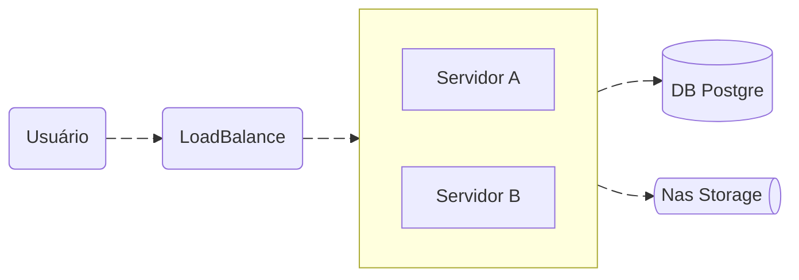

# Ahtlas — Frontend

O Ahtlas é uma plataforma corporativa de gestão interna que desenvolvi entre 2021 e 2025. Ela reúne, em uma única aplicação web, módulos de indicadores, remuneração variável, acompanhamento de equipes, relatórios e rotinas operacionais.

Este repositório tem a SPA em Vue 3. A API (Laravel 11) está no repositório `ahtlas-backend`, com a descrição completa da arquitetura, dos módulos e dos destaques técnicos.

> **Sobre este repositório:** este código foi adaptado de um sistema real, usado em produção por uma empresa. Ele está publicado apenas para mostrar a qualidade do meu código: organização, padrões e decisões técnicas. Não foi preparado para ser executado. Nomes de empresas, matrículas, endpoints, credenciais, marcas e dados de pessoas foram removidos ou trocados por valores fictícios, e as integrações dependem de sistemas externos que não fazem parte do código. Logos e banners foram trocados por placeholders.

## Stack

| Uso | Tecnologias |
|---|---|
| Framework | Vue 3 (Composition API, `<script setup>`) |
| UI | Vuetify 3, Material Design Icons |
| Estado | Pinia |
| Rotas | Vue Router 4 |
| HTTP | Axios (`withCredentials`, sessão Sanctum) |
| Gráficos | Chart.js via vue-chartjs |
| Formulários | VeeValidate |
| Build e testes | Vite, Vitest, ESLint + Prettier |

## Arquitetura



O frontend é servido pelos mesmos servidores que o backend, mas em outro endereço, e fala com a API em JSON.

## Organização do código

```
src/
├── Plugins/        # axios (baseURL via VITE_API_BASE_URL), vuetify (tema e cores), chartjs
├── store/          # Pinia: auth, core (layout/carregamento), module (dados da tela), notify
├── router/         # rotas padrão + um arquivo de rotas por módulo (pages/<Módulo>/routes.js)
├── pages/          # telas por módulo: Administration, Management, TacticalCenter, People, ForMe
├── components/
│   ├── Core/       # navegação, notificações, utilitários de formulário, diálogos
│   ├── Layouts/    # layout padrão da aplicação
│   └── Module/     # componentes específicos de cada módulo
└── utils/
```

Os módulos repetem a divisão do backend (Core / Modules / Addons), então cada tela tem uma rota equivalente na API.

## Integração com o controle de acesso

A cada navegação, o `router.beforeEach` chama a rota equivalente na API (`api${to.path}`, com os parâmetros da URL). O middleware `RoutePermission` do backend decide se o usuário pode acessar aquela rota. Se não puder, a tela de "não autorizado" é exibida. Os dados da página chegam na mesma resposta e ficam no store `module`. Assim, as regras de permissão ficam em um só lugar (no backend).

## Execução

O projeto não roda como está: ele depende da API e dos serviços do cliente, que não fazem parte do código. As variáveis abaixo ficam apenas como referência das integrações (veja também o [.env.example](.env.example)).

### Variáveis de ambiente

| Variável | Uso |
|---|---|
| `VITE_API_BASE_URL` | URL base da API Laravel |
| `VITE_MAIL_DOMAIN` | Domínio usado nos links `mailto:` montados a partir da matrícula |
| `VITE_BACKOFFICE_URL` | URL base do sistema de backoffice (links de protocolo no boletim) |

## Licença

Código publicado apenas como portfólio.
